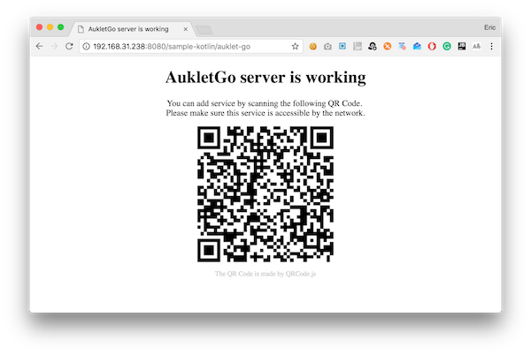
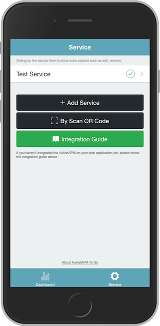
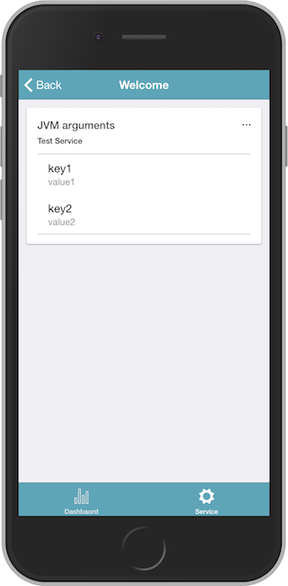

## Installation

Grab via Maven:

```xml
<dependency>
    <groupId>com.aukletapm.go</groupId>
    <artifactId>go</artifactId>
  <version>1.3.1</version>
</dependency>
```

Grab via Gradle:

```
compile group: 'com.aukletapm.go', name: 'go', version: '1.3.1'
```

## Kotlin & servlet integration

#### Configure AukletAPM To Go
import classes

    import com.aukletapm.go.AukletApmToGo

create a service

    val aukletApmToGoService = AukletApmToGo.createInstance("Test Service")

create the index page

    val indexPage = aukletApmToGoService.startIndexPage("Welcome")
    indexPage.endPage()

add a list to the index page to display some runtime status of your web application


```kotlin
indexPage
  .startList("jvm_arguments", "JVM arguments")
  .setContentLoader {
     listOf(
              AukletApmToGo.KeyValue("key1", "value1"),
              AukletApmToGo.KeyValue("key2", "value2")
      )
  }
  .endList()
```

#### Create a servlet handler

Using servlet handler, you can expose the "AukletAPM to Go" HTTP interface into any servlet environment.

##### Add servlet module

Grab via Maven:

```xml
<dependency>
    <groupId>com.aukletapm.go</groupId>
    <artifactId>go-servlet</artifactId>
  <version>1.3.1</version>
</dependency>
```

Grab via Gradle:

```
compile group: 'com.aukletapm.go', name: 'go-servlet', version: '1.3.1'
```

##### Create a servlet handler

```kotlin
val servletHandler = AukletApmToGoHttpServletHandler
  .Builder()
  .enableCors() //not necessary when using Spring MVC
  .service(aukletApmToGoService)
  .build()
```

##### Full code of servlet integration

```kotlin
import com.aukletapm.go.AukletApmToGo
import com.aukletapm.go.servlet.AukletApmToGoHttpServletHandler
import javax.servlet.ServletConfig
import javax.servlet.annotation.WebServlet
import javax.servlet.http.HttpServlet
import javax.servlet.http.HttpServletRequest
import javax.servlet.http.HttpServletResponse

/**
 *
 * @author Eric Xu
 * @date 15/03/2018
 */
@WebServlet("/auklet-go")
class AukletGoServlet : HttpServlet() {

    private lateinit var servletHandler: AukletApmToGoHttpServletHandler

    override fun init(config: ServletConfig?) {
        val aukletGo = AukletApmToGo.createInstance("Test Service")
                .startIndexPage("Welcome")
                .startList("jvm_arguments", "JVM arguments")
                .setContentLoader {
                    listOf(
                            AukletApmToGo.KeyValue("key1", "value1"),
                            AukletApmToGo.KeyValue("key2", "value2")
                    )
                }
                .endList()
                .endPage()

        servletHandler = AukletApmToGoHttpServletHandler
                .Builder()
                .enableCors() //not necessary when using Spring MVC
                .service(aukletGo)
                .build()
    }

    override fun doPost(req: HttpServletRequest?, resp: HttpServletResponse?) {
        servletHandler.handle(req!!, resp!!)
    }

    override fun doGet(req: HttpServletRequest?, resp: HttpServletResponse?) {
        servletHandler.handle(req!!, resp!!)
    }
}
```

##### Add service into AukletAPM To Go

Then start your web application, open `http://your-ip:port/context-path/auklet-go` in the web browser, you will see the welcome page of the Auklet Go server as follows:



Now, the server is runing. You can open the "AukletAPM To Go" scaning this QR Code to add your service into the "AukletAPM to Go".  
After that, you can monitor all the status that you was configured which at your fingertips.




