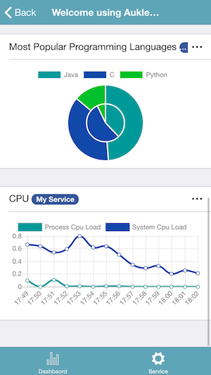

You can download the sample project at [Github](https://github.com/aukletapm/aukletapm-to-go-sample-java-gradle).


#### Add servlet module

Grab via Maven:

```xml
<dependency>
    <groupId>com.aukletapm.go</groupId>
    <artifactId>go-servlet</artifactId>
  <version>1.4.0</version>
</dependency>
```

Grab via Gradle:

```
compile group: 'com.aukletapm.go', name: 'go-servlet', version: '1.4.0'
```

#### Full servlet example

```java
import com.aukletapm.go.AukletApmToGo;
import com.aukletapm.go.LineChart;
import com.aukletapm.go.servlet.AukletApmToGoHttpServletHandler;
import com.google.common.collect.Lists;
import com.sun.management.UnixOperatingSystemMXBean;

import javax.servlet.ServletException;
import javax.servlet.annotation.WebServlet;
import javax.servlet.http.HttpServlet;
import javax.servlet.http.HttpServletRequest;
import javax.servlet.http.HttpServletResponse;
import java.io.IOException;
import java.lang.management.ManagementFactory;
import java.lang.management.OperatingSystemMXBean;
import java.text.SimpleDateFormat;
import java.util.ArrayList;
import java.util.stream.Collectors;

/**
 * @author Eric Xu
 * @date 19/03/2018
 */
@WebServlet("/aukletapm-to-go")
public class AukletApmToGoServlet extends HttpServlet {

    private AukletApmToGoHttpServletHandler servletHandler;


    @Override
    public void init() throws ServletException {

        //creates a service instance
        AukletApmToGo service = AukletApmToGo.Companion.createInstance("My Service")
                .startIndexPage("Welcome using AukletAPM") //create index page

                .startList("system_properties", "System Properties") //shows system properties in a list component
                .setContentLoader(o -> System.getProperties().entrySet().stream().map(objectObjectEntry -> new AukletApmToGo.KeyValue(objectObjectEntry.getKey().toString(), objectObjectEntry.getValue().toString())).collect(Collectors.toList()))
                .endList()


                .startList("os_info", "OS Information") //shows OS information in a list component
                .setContentLoader(o -> {
                    OperatingSystemMXBean os = ManagementFactory.getOperatingSystemMXBean();
                    return Lists.newArrayList(
                            new AukletApmToGo.KeyValue("Available Processors", String.format("%s", os.getAvailableProcessors())),
                            new AukletApmToGo.KeyValue("System Load Average", String.format("%s", os.getSystemLoadAverage())),
                            new AukletApmToGo.KeyValue("Arch", os.getArch())
                    );

                })
                .endList()

                .startPieChart("most_popular_programming_languages", "Most Popular Programming Languages")
                .setContentLoader(o -> new AukletApmToGo.PieChartData.Builder()
                        .data("2017", "Java", 13.27)
                        .data("2017", "C", 10.16)
                        .data("2017", "Python", 3.78)
                        .data("2016", "Java", 11.27)
                        .data("2016", "C", 16.33)
                        .data("2016", "Python", 2.11)
                        .build())
                .endPieChart()

                .startLineChart("cpu")
                .description("CPU")
                .formatLabel(time -> new SimpleDateFormat("HH:mm").format(time))
                .loadData(() -> {
                    OperatingSystemMXBean os = ManagementFactory.getOperatingSystemMXBean();
                    if (os instanceof UnixOperatingSystemMXBean) {
                        return Lists.newArrayList(
                                new LineChart.LoadData("Process Cpu Load", ((UnixOperatingSystemMXBean) os).getProcessCpuLoad()),
                                new LineChart.LoadData("System Cpu Load", ((UnixOperatingSystemMXBean) os).getSystemCpuLoad())
                        );
                    } else {
                        return new ArrayList();
                    }
                })
                .endLineChart()
                .endPage();

        //creates a servlet handler
        servletHandler = new AukletApmToGoHttpServletHandler.Builder().enableCors().service(service).build();
    }

    @Override
    protected void doOptions(HttpServletRequest req, HttpServletResponse resp) throws ServletException, IOException { servletHandler.handle(req, resp); }

    @Override
    protected void doGet(HttpServletRequest req, HttpServletResponse resp) throws ServletException, IOException { servletHandler.handle(req, resp); }

    @Override
    protected void doPost(HttpServletRequest req, HttpServletResponse resp) throws ServletException, IOException { servletHandler.handle(req, resp); }

}
```

#### Add service into AukletAPM To Go

Then start your web application, open `http://your-ip:port/context-path/aukletapm-to-go` in the web browser, you will see the welcome page of the AukletAPM To Go server as follows:


The server is started. Open the "AukletAPM To Go" scanning the QR Code to add your service.

Now, you can monitor all the status what you configured at your fingertips.





## Download
<a href="https://itunes.apple.com/us/app/AukletAPM/id1351572279?mt=8" target="_blank"></a>
<a href="https://play.google.com/store/apps/details?id=com.aukletapm.go" target="_blank"></a>