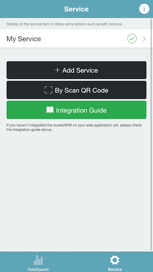
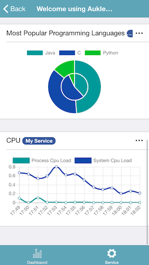
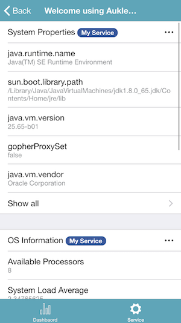

You can download the sample project at [Github](https://github.com/aukletapm/aukletapm-to-go-sample-kotlin-gradle).

#### Configure AukletAPM To Go
import classes

    import com.aukletapm.go.AukletApmToGo

create a service

    val aukletApmToGoService = AukletApmToGo.createInstance("Test Service")

create the index page

    val indexPage = aukletApmToGoService.startIndexPage("Welcome")
    indexPage.endPage()

add a list to the index page to display some runtime status of your web application


```kotlin
indexPage
  .startList("jvm_arguments", "JVM arguments")
  .setContentLoader {
     listOf(
              AukletApmToGo.KeyValue("key1", "value1"),
              AukletApmToGo.KeyValue("key2", "value2")
      )
  }
  .endList()
```

#### Create a servlet handler

Using servlet handler, you can expose the "AukletAPM to Go" HTTP interface into any servlet environment.

##### Add servlet module

Grab via Maven:

```xml
<dependency>
    <groupId>com.aukletapm.go</groupId>
    <artifactId>go-servlet</artifactId>
  <version>1.4.0</version>
</dependency>
```

Grab via Gradle:

```
compile group: 'com.aukletapm.go', name: 'go-servlet', version: '1.4.0'
```

##### Create a servlet handler

```kotlin
val servletHandler = AukletApmToGoHttpServletHandler
  .Builder()
  .enableCors() //not necessary when using Spring MVC
  .service(aukletApmToGoService)
  .build()
```

##### Full code of servlet integration

```kotlin
import com.aukletapm.go.AukletApmToGo
import com.aukletapm.go.servlet.AukletApmToGoHttpServletHandler
import javax.servlet.ServletConfig
import javax.servlet.annotation.WebServlet
import javax.servlet.http.HttpServlet
import javax.servlet.http.HttpServletRequest
import javax.servlet.http.HttpServletResponse

/**
 *
 * @author Eric Xu
 * @date 15/03/2018
 */
@WebServlet("/aukletapm-to-go")
class AukletGoServlet : HttpServlet() {

    private lateinit var servletHandler: AukletApmToGoHttpServletHandler

    override fun init(config: ServletConfig?) {
        val aukletGo = AukletApmToGo.createInstance("Test Service")
                .startIndexPage("Welcome")
                .startList("jvm_arguments", "JVM arguments")
                .setContentLoader {
                    listOf(
                            AukletApmToGo.KeyValue("key1", "value1"),
                            AukletApmToGo.KeyValue("key2", "value2")
                    )
                }
                .endList()
                .endPage()

        servletHandler = AukletApmToGoHttpServletHandler
                .Builder()
                .enableCors() //not necessary when using Spring MVC
                .service(aukletGo)
                .build()
    }

    override fun doPost(req: HttpServletRequest?, resp: HttpServletResponse?) {
        servletHandler.handle(req!!, resp!!)
    }

    override fun doGet(req: HttpServletRequest?, resp: HttpServletResponse?) {
        servletHandler.handle(req!!, resp!!)
    }
}
```

Then start your web application, open `http://your-ip:port/context-path/aukletapm-to-go` in the web browser, you will see the welcome page of the AukletAPM To Go server as follows:


The server is started. Open the "AukletAPM To Go" scanning the QR Code to add your service.

Now, you can monitor all the status what you configured at your fingertips.





## Download
<a href="https://itunes.apple.com/us/app/AukletAPM/id1351572279?mt=8" target="_blank"></a>
<a href="https://play.google.com/store/apps/details?id=com.aukletapm.go" target="_blank"></a>

