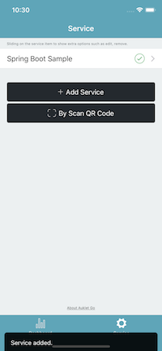
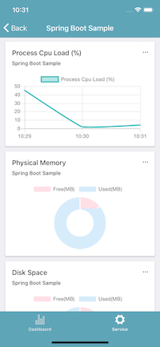
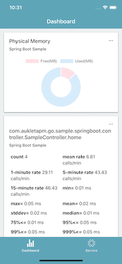

Monitor and manage your web applications wherever you go.
## Overview

`AukletAPM To Go` is a mobile application. It is used for the web application monitor and management.  
It enables you to access the runtime status of your web applications with the mobile phone such as CPU usage, memory usage, interface performance etc.

## Download

For detailed instructions see the [getting started guide](getting-started.md).