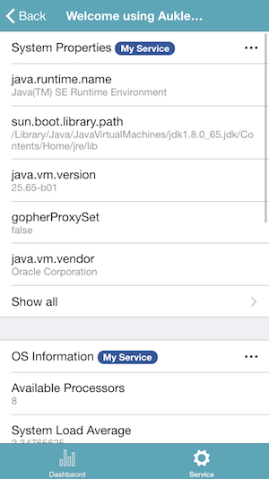

# AukletAPM To Go


AukletAPM To Go provides a group of fluent API(Java, Kotlin) for you to integrate your web applications.  
You can use it for monitoring system performance or any other data, which you want to see it with the mobile phone.

#### Show system properties
```java
aukletApmToGoService
.startList("system_properties", "System Properties")
.setContentLoader(o -> System.getProperties().entrySet().stream().map(objectObjectEntry -> new AukletApmToGo.KeyValue(objectObjectEntry.getKey().toString(), objectObjectEntry.getValue().toString())).collect(Collectors.toList()))
.endList()

```

#### Show OS information
```java
aukletApmToGoService
.startList("os_info", "OS Information") //shows OS information in a list component
.setContentLoader(o -> {
    OperatingSystemMXBean os = ManagementFactory.getOperatingSystemMXBean();
    return Lists.newArrayList(
            new AukletApmToGo.KeyValue("Available Processors", String.format("%s", os.getAvailableProcessors())),
            new AukletApmToGo.KeyValue("System Load Average", String.format("%s", os.getSystemLoadAverage())),
            new AukletApmToGo.KeyValue("Arch", os.getArch())
    );

})
.endList()
```

#### Show some user data
```java
aukletApmToGoService
.startPieChart("most_popular_programming_languages", "Most Popular Programming Languages")
.setContentLoader(o -> new AukletApmToGo.PieChartData.Builder()
        .data("2017", "Java", 13.27)
        .data("2017", "C", 10.16)
        .data("2017", "Python", 3.78)
        .data("2016", "Java", 11.27)
        .data("2016", "C", 16.33)
        .data("2016", "Python", 2.11)
        .build())
.endPieChart()
```

#### Show CPU load
```java
aukletApmToGoService
.startLineChart("cpu")
.description("CPU")
.formatLabel(time -> new SimpleDateFormat("HH:mm").format(time))
.loadData(() -> {
    OperatingSystemMXBean os = ManagementFactory.getOperatingSystemMXBean();
    if (os instanceof UnixOperatingSystemMXBean) {
        return Lists.newArrayList(
                new LineChart.LoadData("Process Cpu Load", ((UnixOperatingSystemMXBean) os).getProcessCpuLoad()),
                new LineChart.LoadData("System Cpu Load", ((UnixOperatingSystemMXBean) os).getSystemCpuLoad())
        );
    } else {
        return new ArrayList();
    }
})
.endLineChart()
```





## Architecture
The architecture of AutletAPM To Go is very simple as follows:  


The server-side API code is also simple and robust.

[](https://travis-ci.org/aukletapm/aukletapm-to-go)
[](https://codecov.io/gh/aukletapm/aukletapm-to-go/branch/master)


## Download
<a href="https://itunes.apple.com/us/app/AukletAPM/id1351572279?mt=8" target="_blank"></a>
<a href="https://play.google.com/store/apps/details?id=com.aukletapm.go" target="_blank"></a>

For detailed instructions see the [getting started guide](getting-started/index.md).